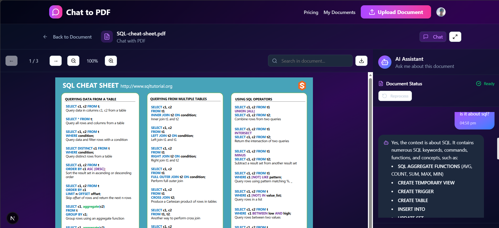

# Chat with PDF — AI-Powered Interactive PDF Platform

An intelligent document platform that lets you upload PDFs and have real-time AI conversations with them. Ask questions, extract insights, and get instant summaries — all powered by Google Gemini and semantic vector search.



## Features

- **AI Chat** — Stream real-time responses from Google Gemini based on your document's content
- **Semantic Search** — Pinecone vector embeddings find the most relevant chunks before every answer
- **Secure by Default** — Clerk authentication, per-user data isolation, ownership checks on every API route
- **Rate Limiting** — Upstash Redis-backed rate limiting on upload, process, and chat endpoints
- **Cascade Delete** — Deleting a document removes Cloudinary files, Pinecone vectors, and all chat history
- **Upload Enforcement** — Free tier capped at 3 documents per user
- **Error Boundaries** — Three-tier error boundary system with graceful fallbacks
- **Responsive UI** — Skeleton screens, streaming typing indicators, and optimistic message updates

## Tech Stack

| Layer             | Technology                                    |
| ----------------- | --------------------------------------------- |
| Framework         | Next.js 15 (App Router)                       |
| Auth              | Clerk                                         |
| Database          | Firebase Firestore                            |
| File Storage      | Cloudinary                                    |
| Vector Store      | Pinecone                                      |
| AI Model          | Google Gemini (`gemini-2.5-flash`)            |
| Embeddings        | Google Generative AI (`gemini-embedding-001`) |
| LLM Orchestration | LangChain                                     |
| Rate Limiting     | Upstash Redis                                 |
| PDF Rendering     | react-pdf                                     |

## Getting Started

### 1. Clone the repo

```bash
git clone https://github.com/Krunal2206/AI-Powered_Interactive_PDF_Platform.git
cd AI-Powered_Interactive_PDF_Platform
npm install
```

### 2. Set up environment variables

Copy `.env.example` to `.env` and fill in your keys:

```bash
cp .env.example .env
```

You'll need accounts on: [Clerk](https://clerk.com), [Firebase](https://firebase.google.com), [Cloudinary](https://cloudinary.com), [Pinecone](https://pinecone.io), [Google AI Studio](https://aistudio.google.com), and [Upstash](https://upstash.com).

### 3. Run the development server

```bash
npm run dev
```

Open [http://localhost:3000](http://localhost:3000) to see the app.

## Environment Variables

| Variable                                   | Where to get it                                     |
| ------------------------------------------ | --------------------------------------------------- |
| `NEXT_PUBLIC_CLERK_PUBLISHABLE_KEY`        | Clerk Dashboard → API Keys                          |
| `CLERK_SECRET_KEY`                         | Clerk Dashboard → API Keys                          |
| `NEXT_PUBLIC_FIREBASE_API_KEY`             | Firebase Console → Project Settings                 |
| `NEXT_PUBLIC_FIREBASE_AUTH_DOMAIN`         | Firebase Console → Project Settings                 |
| `NEXT_PUBLIC_FIREBASE_PROJECT_ID`          | Firebase Console → Project Settings                 |
| `NEXT_PUBLIC_FIREBASE_STORAGE_BUCKET`      | Firebase Console → Project Settings                 |
| `NEXT_PUBLIC_FIREBASE_MESSAGING_SENDER_ID` | Firebase Console → Project Settings                 |
| `NEXT_PUBLIC_FIREBASE_APP_ID`              | Firebase Console → Project Settings                 |
| `CLOUDINARY_CLOUD_NAME`                    | Cloudinary Dashboard                                |
| `CLOUDINARY_API_KEY`                       | Cloudinary Dashboard                                |
| `CLOUDINARY_API_SECRET`                    | Cloudinary Dashboard                                |
| `PINECONE_API_KEY`                         | Pinecone Console → API Keys                         |
| `PINECONE_INDEX_NAME`                      | Pinecone Console → Indexes                          |
| `GOOGLE_API_KEY`                           | Google AI Studio → API Keys                         |
| `UPSTASH_REDIS_REST_URL`                   | Upstash Console → Redis Database                    |
| `UPSTASH_REDIS_REST_TOKEN`                 | Upstash Console → Redis Database                    |
| `NEXT_PUBLIC_BASE_URL`                     | Your production URL (e.g. `https://yourdomain.com`) |

## Project Structure

```
├── app/
│   ├── api/
│   │   ├── chat/[documentId]/        # Streaming chat endpoint
│   │   ├── documents/[id]/           # Process, delete, Cloudinary ops
│   │   └── upload-pdf/               # Upload with tier enforcement
│   ├── dashboard/                    # Authenticated document management
│   └── pricing/                      # Pricing page
├── components/
│   ├── HomePage/                     # Landing page sections
│   └── PdfChatPage/                  # PDF viewer + chat UI
├── hooks/
│   ├── useChat.ts                    # Streaming chat state management
│   └── usePDFProcessing.ts           # Document processing state
└── lib/
    ├── chatService.ts                # Gemini chat with streaming
    ├── vectorStore.ts                # Pinecone embeddings + similarity search
    ├── firebaseops.ts                # Document CRUD
    ├── firebaseChatOps.ts            # Chat session + message ops
    └── rateLimit.ts                  # Upstash Redis rate limiters
```

## How It Works

1. **Upload** — PDF is uploaded to Cloudinary; metadata saved to Firestore
2. **Process** — PDF text is extracted, split into chunks, embedded via Gemini, and stored in Pinecone
3. **Chat** — User message is embedded, top-k similar chunks are retrieved from Pinecone, passed as context to Gemini, and the response streams back token by token
4. **Delete** — Cascade delete removes Cloudinary file, Pinecone vectors, Firestore document, and all chat history