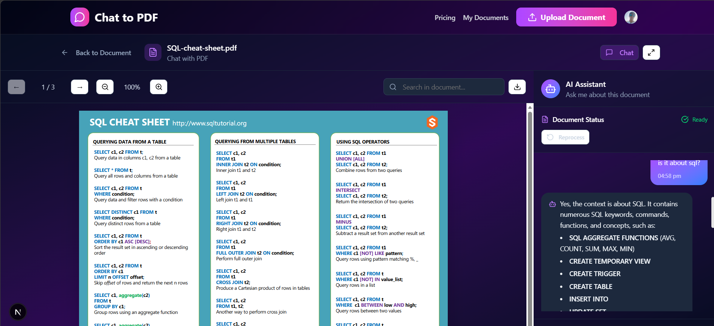

# Chat with PDF — AI-Powered Interactive PDF Platform

An intelligent document platform that lets you upload PDFs and have real-time AI conversations with them. Ask questions, extract insights, and get instant summaries — all powered by Google Gemini and semantic vector search.



## Features

- **AI Chat** — Stream real-time responses from Google Gemini based on your document's content
- **Semantic Search** — Pinecone vector embeddings find the most relevant chunks before every answer
- **Drag-and-Drop Upload** — Upload PDFs via an interactive dropzone with real-time progress tracking
- **Secure by Default** — Clerk authentication, per-user data isolation, ownership checks on every API route
- **Rate Limiting** — Upstash Redis-backed rate limiting on upload, process, and chat endpoints
- **Cascade Delete** — Deleting a document removes Cloudinary files, Pinecone vectors, and all chat history
- **Upload Enforcement** — Free tier capped at 3 documents per user
- **Document Search & Filtering** — Search and filter documents from the dashboard
- **Error Boundaries** — Three-tier error boundary system (`ErrorBoundary`, `InlineErrorBoundary`, custom fallbacks) with graceful recovery
- **Toast Notifications** — Context-based toast system with animated progress bars and variant support (success, error, warning, info)
- **Responsive UI** — Skeleton screens, streaming typing indicators, optimistic message updates, and mobile-aware layout via `useResponsive`
- **Markdown Rendering** — AI responses rendered as rich Markdown with GFM support
- **SEO** — Auto-generated `robots.txt` and `sitemap.xml` via Next.js metadata routes

## Tech Stack

| Layer             | Technology                                    |
| ----------------- | --------------------------------------------- |
| Framework         | Next.js 15 (App Router, Turbopack)            |
| Language          | TypeScript                                    |
| Auth              | Clerk                                         |
| Database          | Firebase Firestore                            |
| File Storage      | Cloudinary                                    |
| Vector Store      | Pinecone                                      |
| AI Model          | Google Gemini (`gemini-2.5-flash`)            |
| Embeddings        | Google Generative AI (`gemini-embedding-001`) |
| LLM Orchestration | LangChain                                     |
| Rate Limiting     | Upstash Redis                                 |
| PDF Rendering     | react-pdf                                     |
| PDF Parsing       | pdf-parse                                     |
| Styling           | Tailwind CSS v4                               |
| Markdown          | react-markdown + remark-gfm                   |
| File Upload UX    | react-dropzone                                |
| UI Primitives     | Radix UI                                      |
| Icons             | Lucide React                                  |

## Getting Started

### 1. Clone the repo

```bash
git clone https://github.com/Krunal2206/AI-Powered_Interactive_PDF_Platform.git
cd AI-Powered_Interactive_PDF_Platform
npm install
```

### 2. Set up environment variables

Copy `.env.example` to `.env` and fill in your keys:

```bash
cp .env.example .env
```

You'll need accounts on: [Clerk](https://clerk.com), [Firebase](https://firebase.google.com), [Cloudinary](https://cloudinary.com), [Pinecone](https://pinecone.io), [Google AI Studio](https://aistudio.google.com), and [Upstash](https://upstash.com).

### 3. Run the development server

```bash
npm run dev
```

Open [http://localhost:3000](http://localhost:3000) to see the app.

## Environment Variables

| Variable                                   | Where to get it                                     |
| ------------------------------------------ | --------------------------------------------------- |
| `NEXT_PUBLIC_CLERK_PUBLISHABLE_KEY`        | Clerk Dashboard → API Keys                          |
| `CLERK_SECRET_KEY`                         | Clerk Dashboard → API Keys                          |
| `NEXT_PUBLIC_FIREBASE_API_KEY`             | Firebase Console → Project Settings                 |
| `NEXT_PUBLIC_FIREBASE_AUTH_DOMAIN`         | Firebase Console → Project Settings                 |
| `NEXT_PUBLIC_FIREBASE_PROJECT_ID`          | Firebase Console → Project Settings                 |
| `NEXT_PUBLIC_FIREBASE_STORAGE_BUCKET`      | Firebase Console → Project Settings                 |
| `NEXT_PUBLIC_FIREBASE_MESSAGING_SENDER_ID` | Firebase Console → Project Settings                 |
| `NEXT_PUBLIC_FIREBASE_APP_ID`              | Firebase Console → Project Settings                 |
| `NEXT_PUBLIC_FIREBASE_MEASUREMENT_ID`      | Firebase Console → Project Settings                 |
| `CLOUDINARY_CLOUD_NAME`                    | Cloudinary Dashboard                                |
| `CLOUDINARY_API_KEY`                       | Cloudinary Dashboard                                |
| `CLOUDINARY_API_SECRET`                    | Cloudinary Dashboard                                |
| `CLOUDINARY_UPLOAD_FOLDER`                 | Defaults to `pdf-documents`                         |
| `PINECONE_API_KEY`                         | Pinecone Console → API Keys                         |
| `PINECONE_INDEX_NAME`                      | Pinecone Console → Indexes                          |
| `GOOGLE_API_KEY`                           | Google AI Studio → API Keys                         |
| `UPSTASH_REDIS_REST_URL`                   | Upstash Console → Redis Database                    |
| `UPSTASH_REDIS_REST_TOKEN`                 | Upstash Console → Redis Database                    |
| `NEXT_PUBLIC_BASE_URL`                     | Your production URL (e.g. `https://yourdomain.com`) |

## Project Structure

```
├── app/
│   ├── (home)/                         # Landing page (route group)
│   │   ├── layout.tsx
│   │   └── page.tsx
│   ├── api/
│   │   ├── chat/[documentId]/          # Streaming chat endpoint
│   │   ├── documents/[id]/
│   │   │   ├── cloudinary/             # Cloudinary file operations
│   │   │   └── process/                # PDF processing endpoint
│   │   └── upload-pdf/                 # Upload with tier enforcement
│   ├── dashboard/
│   │   ├── chat/[id]/                  # PDF viewer + AI chat page
│   │   ├── document/[id]/              # Document detail page
│   │   ├── upload/                     # Upload page with dropzone
│   │   ├── layout.tsx
│   │   ├── loading.tsx                 # Dashboard skeleton loader
│   │   └── page.tsx                    # Document grid with search
│   ├── pricing/                        # Pricing page
│   ├── robots.ts                       # SEO robots.txt generation
│   ├── sitemap.ts                      # SEO sitemap.xml generation
│   ├── globals.css
│   └── layout.tsx                      # Root layout with providers
├── components/
│   ├── DashboardPage/                  # Dashboard UI components
│   │   ├── AddDocumentCard.tsx
│   │   ├── DocumentCard.tsx
│   │   ├── DocumentCardSkeleton.tsx
│   │   ├── DocumentDetailSkeleton.tsx
│   │   ├── DocumentSearchFilters.tsx
│   │   ├── DropZone.tsx
│   │   ├── ErrorMessage.tsx
│   │   ├── FileItem.tsx
│   │   ├── FileList.tsx
│   │   ├── FileProgressBar.tsx
│   │   ├── LoadingSpinner.tsx
│   │   ├── Navbar.tsx
│   │   ├── Skeleton.tsx
│   │   ├── StatusBadge.tsx
│   │   └── UploadAlert.tsx
│   ├── ErrorBoundary.tsx               # ErrorBoundary + InlineErrorBoundary
│   ├── HomePage/                       # Landing page sections
│   │   ├── CTASection.tsx
│   │   ├── FeaturesSection.tsx
│   │   ├── HeroSection.tsx
│   │   ├── HomeNavbar.tsx
│   │   └── HowItWorksSection.tsx
│   ├── PdfChatPage/                    # PDF viewer + chat UI
│   │   ├── ChatHeader.tsx
│   │   ├── ChatInput.tsx
│   │   ├── ChatMessage.tsx
│   │   ├── ChatPageSkeleton.tsx
│   │   ├── ChatPanel.tsx
│   │   ├── LoadingIndicator.tsx
│   │   ├── PDFDocument.tsx
│   │   ├── PDFToolbar.tsx
│   │   ├── PDFViewer.tsx
│   │   └── ProcessingStatus.tsx
│   ├── PricingPage/
│   │   └── Header.tsx
│   └── ui/                             # Shared Radix-based UI primitives
├── constants/
│   └── upload.ts                       # Upload config (limits, progress)
├── hooks/
│   ├── useChat.ts                      # Streaming chat state management
│   ├── useFileUpload.ts                # File upload with progress simulation
│   ├── usePDFProcessing.ts             # Document processing state
│   ├── useResponsive.ts                # Mobile breakpoint detection
│   └── useToast.tsx                    # Toast notification context + provider
├── lib/
│   ├── chatService.ts                  # Gemini chat with streaming
│   ├── documentUtils.ts                # Document helper utilities
│   ├── errorHandling.ts                # Centralized error handling
│   ├── firebaseChatOps.ts              # Chat session + message ops
│   ├── firebaseChunkOps.ts             # Firestore chunk storage
│   ├── firebaseops.ts                  # Document CRUD
│   ├── navigationUtils.ts              # Client-side navigation helpers
│   ├── pdfProcessor.ts                 # PDF text extraction + chunking
│   ├── rateLimit.ts                    # Upstash Redis rate limiters
│   ├── upload.ts                       # Upload utilities
│   ├── utils.ts                        # General utilities (cn helper)
│   └── vectorStore.ts                  # Pinecone embeddings + similarity search
├── types/
│   ├── chat.ts                         # Chat-related type definitions
│   └── upload.ts                       # Upload-related type definitions
├── cloudinary.ts                       # Cloudinary SDK configuration
├── firebase.ts                         # Firebase SDK initialization
└── middleware.ts                       # Clerk auth middleware
```

## How It Works

1. **Upload** — PDF is uploaded to Cloudinary via a drag-and-drop dropzone; metadata is saved to Firestore
2. **Process** — PDF text is extracted with pdf-parse, split into chunks via LangChain's `RecursiveCharacterTextSplitter`, embedded via Gemini, and stored in Pinecone
3. **Chat** — User message is embedded, top-k similar chunks are retrieved from Pinecone, passed as context to Gemini, and the response streams back token by token
4. **Delete** — Cascade delete removes Cloudinary file, Pinecone vectors, Firestore document, and all chat history